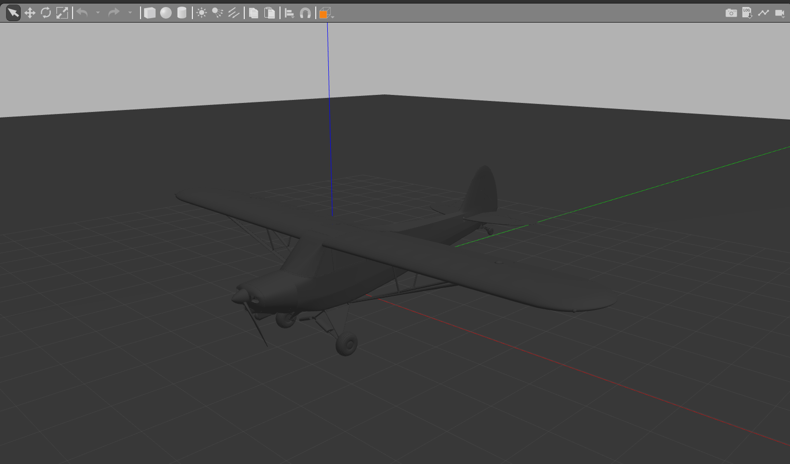

# 2024-tfm-walter-cuenca

## Week 2:
###  Airplane in Gazebo
We have found [free3d](https://free3d.com/3d-models/airplane) and 
[cgtrader](https://www.cgtrader.com/es/gratis-3d-modelos/avion) web pages that allow free download of 3D models.

After this, the example model is loaded in Gazebo by accessing **Model Editor** option. 
It allows different file formats such as **.dae**, **.mtl**, etc.

## Week 1 :  Install initial sofware
For the development of the project it is necessary:
* Install **ROS 2 Humble**, use official [installation guide](https://docs.ros.org/en/humble/Installation/Ubuntu-Install-Debians.html
)
* Install **Gazebo 11**, use official [installation guide](https://classic.gazebosim.org/tutorials?tut=install_ubuntu
)
